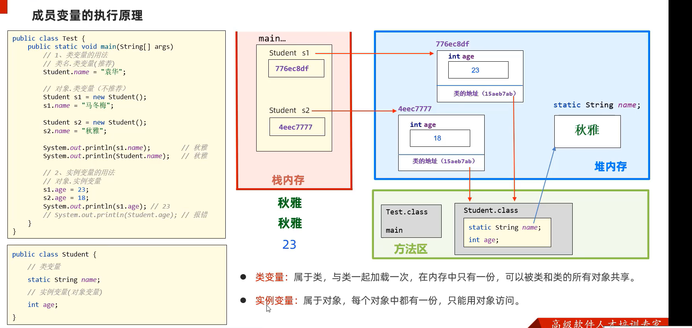
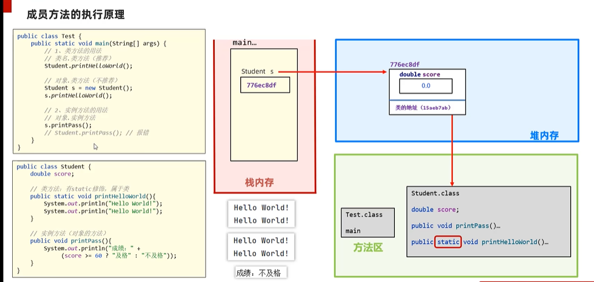
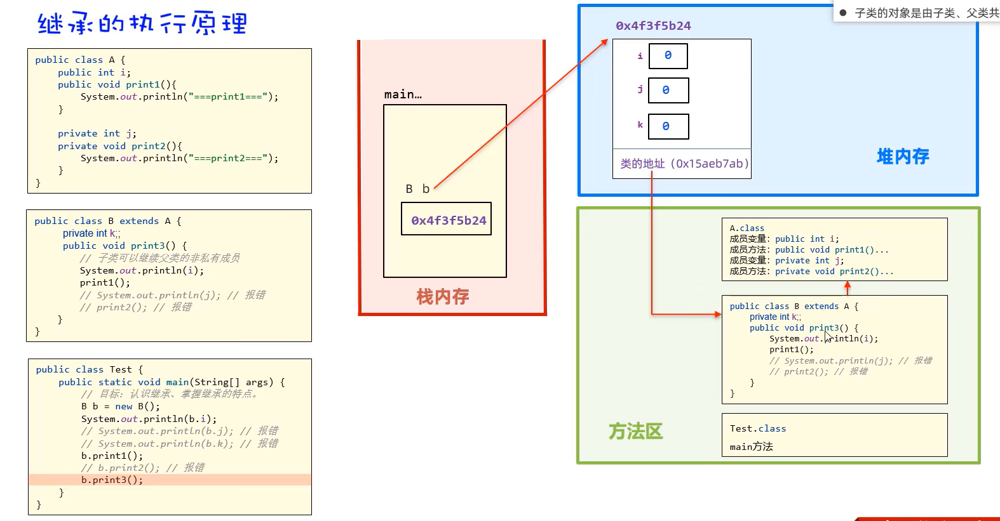
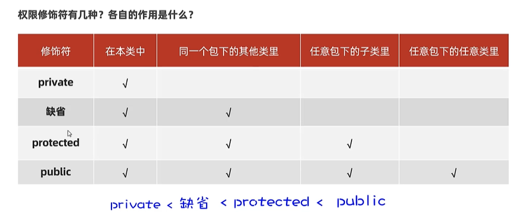
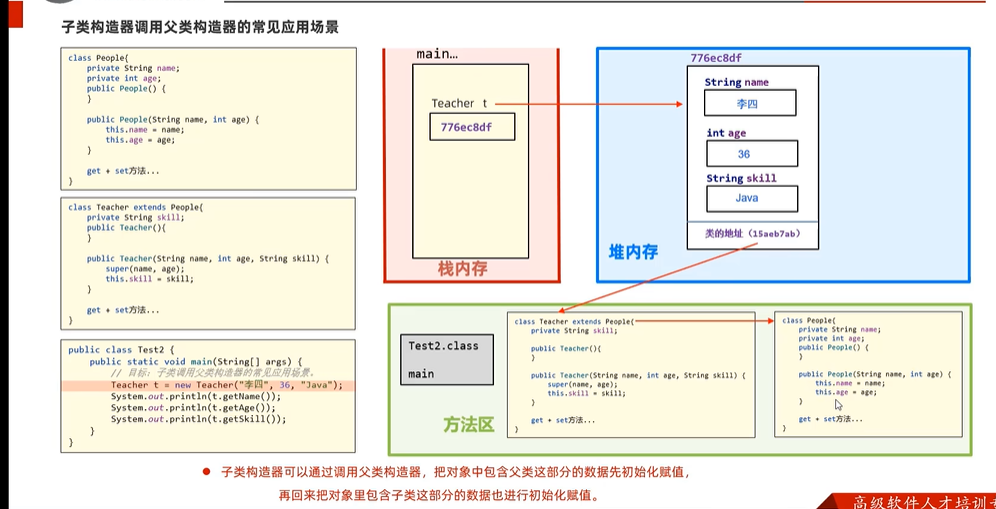

# 面向对象
## static
### static属于类变量，被类的全部对象共享(如果某个数据只需要一份且希望被共享)；实例变量只能被对象调用

### 类方法和实例方法    类方法和类变量属于类，可以直接使用类来调用；但是不能直接访问实例方法和实例变量，因为实例需要对象才能调用
### 实例方法可以访问类变量和类方法。也可以直接访问实例成员
### 实例方法可以出现this关键字，类方法不可以出现this关键字；this指代的是当前对象
### 类方法可以作为工具类，给开发人员共同使用;相对于实例方法，需要创建对象才能访问，类方法不需要创建对象也就不需要占用内存
### 可以将工具类的构造器设为私有的，防止创建对象

### 代码块：静态代码块static{}只执行一次，完成初始化需求；实例代码块{}每次创建对象时执行实例代码块，并在构造器之前执行，完成初始化，重复代码可以放在实例代码块里面编写
### 单例设计模式：确保一个类只有一个对象（把类的构造器私有；定义一个类变量记住类的一个对象；定义一个类方法返回类的对象）比如任务管理器就是单例设计模式，无论打开多少次，都只会出现一个窗口(饿汉式单例)
### 懒汉式单例设计模式：拿对象时，才开始创建对象（把类的构造器私有；定义一个类变量用于存储对象；提供一个类方法保证返回的是同一个对象）

## 继承
### 子类可以继承父类的非私有成员，单继承；python是多重继承，出现矛盾冲突有MRO机制

### 权限修饰符：public private protected 缺省（无修饰）只能在本类使用 ;
### 如果一个类没有修饰符，默认是"package-private" 类。类可以被同一个包中的其他类访问，但不能被不同包中的类访问。 这种访问修饰符通常用于实现隐藏某些类的细节，使其对包外的类不可见
### 不加修饰符的方法，类，变量都只能在同一个包内访问

### 方法重写：（声明不变，重新实现）子类的同名字方法会覆盖父类的方法；加上@override可以帮助检查语法;子类的访问权限必须大于或等于父类该方法的权限；返回值必须一样；私有的方法和静态方法不能重写
### 在子类方法中访问其他成员，就近原则：优先访问子类的this.name，子类没有再去父类；如果一定要访问父类的使用super.name
### 子类的全部构造器会优先调用父类的无参构造器，再执行自己的(在子类的构造器之前都默认有super();)如果父类没有无参构造器，需要手动添加super

### this()会优先调用兄弟构造器

## 多态
### 有继承/实现的关系；存在父类引用子类对象；存在方法重写；对象多态、行为多态（编译看左边，运行看右边）
### 在多态的形式下，右边的对象是解耦合的，便于维护和扩展（右边的子类对象是可以更改的）
### 定义的方法时，使用父类类型的形参可以接收子类对象
### 多态下不能使用子类的独有功能，需要进行多态的类型转换（Student s = (Student) p）
### instanceof 用于检查一个对象是否指定类型或子类的一个实例

## final、常量
### final修饰的类、方法、变量，不能被继承、不能被重写、只能被赋值一次
### 使用static final修饰的成员变量是常量，一般是配饰信息，一般也用大写命名 public static final String SCHOOL_NAME

## 抽象
### 抽象类：用abstract修饰，不能创建对象，仅作为一种特殊的父类，让子类继承并实现；类该有的成员抽象类都有
### 有抽象方法的类一定是抽象类，反之不一定；抽象方法没有方法体
### 继承抽象类必须实现全部的抽象方法
### 抽象类给子类指明方向，具体怎么做看子类